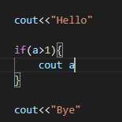
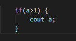
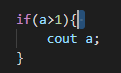
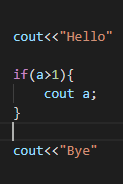
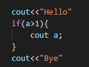
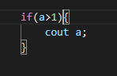
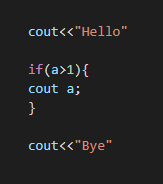
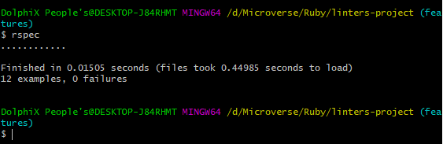

# Linter project

This project is a C++ linter that flags basic errors to include readablity.

Listed below are the methods built in this project:

-   `check_trailing` 
-   `check_semi_colon`
-   `check_paranthesis`
-   `check_empty_space` 
-   `check_empty_line`
-   `check_below_line`
-   `check_indentation` 


## Built With
-   Ruby

## C++ linter cases

`Good code`

```bash
cout<<"Hello"

if(a>1) {
    cout<<a;
}

cout<<"Bye"

```

`Bad code`


`Good code`


`Bad code`


`Good code`


`Bad code`


`Good code`


`Bad code`


`Good code`


`Bad code`



## Getting Started

To get a local copy of the repository please run the following commands on your terminal:

    $ git clone https://github.com/NtwaliHeritier/linters-project

    $ cd linters-project

## Test

1. Open a terminal
2. Run 'gem install rspec'
3. Run 'cd linters-project'
4. Run rspec --init’ to install rspec in directory

## Run

1. Run 'rspec' in the terminal
2. In the terminal, you should see if the tests pass or fail.


## Authors
👤  **Ntwali Heritier**

- Github: [@NtwaliHeritier](https://github.com/NtwaliHeritier)
- Twitter: [@NtwaliHeritier](https://twitter.com/NtwaliHeritier)
- Linkedin: [Ntwali Heritier](https://linkedin.com/in/ntwali-heritier-9950001a2)

## 🤝 Contributing

Contributions, issues and feature requests are welcome!

## Show your support

Give a ⭐️ if you like this project!
